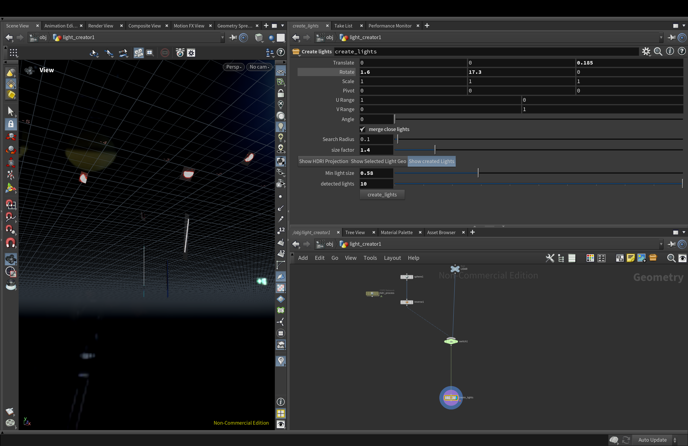

# VFX Reel
[](https://vimeo.com/1133149897?share=copy&fl=sv&fe=ci)

---
# Procedural Lighting Tool (Bachelor Thesis)

A procedural tool developed in Houdini using Python and VEX that automatically generates area lights from LiDAR scans and HDRI data.  
The tool analyzes LiDAR-based geometry, extracts local orientation, computes light dimensions, bakes texture projections, and constructs production-ready lights with correct transforms.

---

## Demo Video  
[](https://vimeo.com/1144911549?share=copy&fl=sv&fe=ci)

---

## Summary of How It Works

The tool:

- Projects the HDRI onto the LiDAR geometry  
- Finds light sources based on an artist-defined luminance threshold  
- Deletes all geometry that is not part of the detected light sources  
- Creates grid geometries representing area lights  
- Extracts a 3×3 transform matrix, converts it into Euler rotations, and computes the light dimensions from the bounding boxes  
- Automatically renders emission maps using COPs based on the projected texture  
- Creates light nodes with the correct transform, size, and baked textures  

---

<details markdown="1">
<summary><strong>Show example code snippet (not full code)</strong></summary>

```python

    # Get the matrix from the point attribute
    pt = xform_geo.iterPoints()[0]
    matrix_vals = pt.attribValue("transform")  # 9 floats
    matrix3 = hou.Matrix3(matrix_vals)

    R = matrix_vals
    R00, R01, R02 = R[0], R[1], R[2]
    R10, R11, R12 = R[3], R[4], R[5]
    R20, R21, R22 = R[6], R[7], R[8]

    if abs(R20) != 1:
        pitch = -math.asin(R20)
        cos_pitch = math.cos(pitch)
        roll = math.atan2(R21 / cos_pitch, R22 / cos_pitch)
        yaw = math.atan2(R10 / cos_pitch, R00 / cos_pitch)
    else:
        yaw = 0
        if R20 == -1:
            pitch = math.pi / 2
            roll = yaw + math.atan2(R01, R02)
        else:
            pitch = -math.pi / 2
            roll = -yaw + math.atan2(-R01, -R02)

    euler_deg = [math.degrees(a) for a in (roll, pitch, yaw)]

    # Get bounding box and center
    bbox = grid_geo.boundingBox()
    center = bbox.center()
    size_x = bbox.sizevec()[0]
    size_y = bbox.sizevec()[1]

    # Get all point positions
    points = grid_geo.points()
    p0 = points[0].position()
    p1 = points[1].position()
    p2 = points[2].position()
    p3 = points[3].position()

    x_vec = p1 - p0
    y_vec = p2 - p0

    size_x = x_vec.length()
    size_y = y_vec.length()

    # Render textures
    rot_x = euler_deg[0]
    if abs(rot_x) > 90:
        flip.bypass(False)

    toCopsNode.cook(force=True)
    cop_node.cook(force=True)

    rop.parm("copoutput").set(texture_path)
    rop.render()

    flip.bypass(True)

    if iteration == 0:
        env_texture_path = f"{version_path}/Environment.exr}"
        rop_env.parm("copoutput").set(env_texture_path)
        rop_env.render()

    # Create the area light
    light = hou.node("/obj").createNode("custom_light", light_name)
    light.parm("light_type").set(2)
    light.parmTuple("position_vector").set(center)
    light.parm("distance_mult").set(1)
    light.parmTuple("rotate").set(euler_deg)
    light.parm("area_sizex").set(size_x)
    light.parm("area_sizey").set(size_y)
    light.parm("light_intensity").set(1.0)
    light.parm("light_enable").set(True)

    # Set textures
    light.parm("light_texture").set(texture_path)


...


```
</details>

---

# Nuke Skript sorter
A tool that automatically cleans up and organizes Nuke node graphs. The tools straightens the primary B pipe, restructures all A-pipes into clean rectangular layouts, and inserts dot nodes where necessary to maintain clear and readable connections.  
Special care is taken to correctly handle secondary B-pipes, ensuring that existing branching logic and node relationships are preserved.  
The result is a significantly more readable node graph. It works best, if used regularly during comping to ensure a clean graph right from the start. The skript uses object orientation and a binary search tree to represent the node graph internally. It and iterates over the selected nodes using recursion.


## Demo


<details markdown="1">
<summary><strong>Show example code snippet (not full code)</strong></summary>

```python
import nuke
import sys
SELECTED_NODES = ()


class ScriptTermination(Exception):
    pass


class BSTNode:

    def __init__(self, node=None, root=None, is_b=False):

        self.val = node

        self.root = root

        self.is_b = is_b

        if not self.is_b:
            self.root = self.val

        self.a = self.get_a()

        self.b = self.get_b()

        # self.printout()

        # only sort selected node
        for node in SELECTED_NODES:
            if self.val == node:
                self.sort()

    def get_b(self):

        if not self.is_selected(self.val):
            return None

        input_b = self.val.input(0)

        if self.val.Class() == "ScanlineRender" or self.val.Class() == "ApplyMaterial":
            input_b = self.val.input(1)

        if self.b_is_on_the_side(input_b):
            return None

        # create child b
        if input_b:
            return BSTNode(input_b, self.root, True)

        else:
            return None

    def get_a(self):
        if not self.is_selected(self.val):
            return None

        if self.val.Class() == "ScanlineRender" or self.val.Class() == "ApplyMaterial":
            b_index = 1
        else:
            b_index = 0

        input_nodes = []
        # Iterate over all possible inputs
        for i in range(self.val.inputs()):
            input_node = self.val.input(i)

            if i is b_index:
                if not self.b_is_on_the_side(input_node):
                    input_node = None
            input_nodes.append(input_node)

        input_a = input_nodes
        if input_a:
            for i in range(len(input_a)):
                node = input_a[i]

            a_BTS_nodes = []
            for a_child in input_a:
                nextInputNode = BSTNode(a_child, self.root)
                a_BTS_nodes.append(nextInputNode)
            return a_BTS_nodes

        return None


...


```
</details>
# Contact

If you would like to get in touch:

**Julian Brednich**  

 **mail:** <julian.brednich@gmail.com>
 
 **LinkedIn:** <https://www.linkedin.com/in/julian-brednich-32aaa8298?lipi=urn%3Ali%3Apage%3Ad_flagship3_profile_view_base_contact_details%3BSl2zvCh%2BTGqH0EAgvzjnFw%3D%3D>

---

