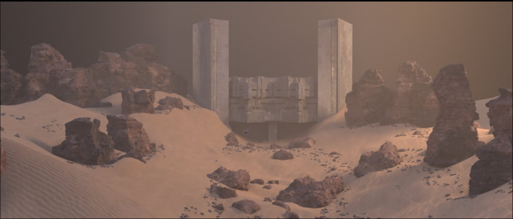
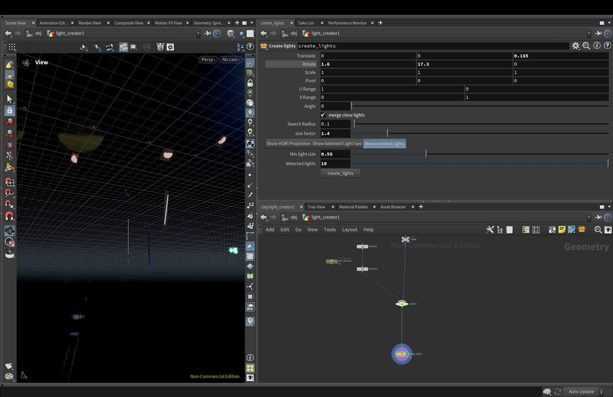
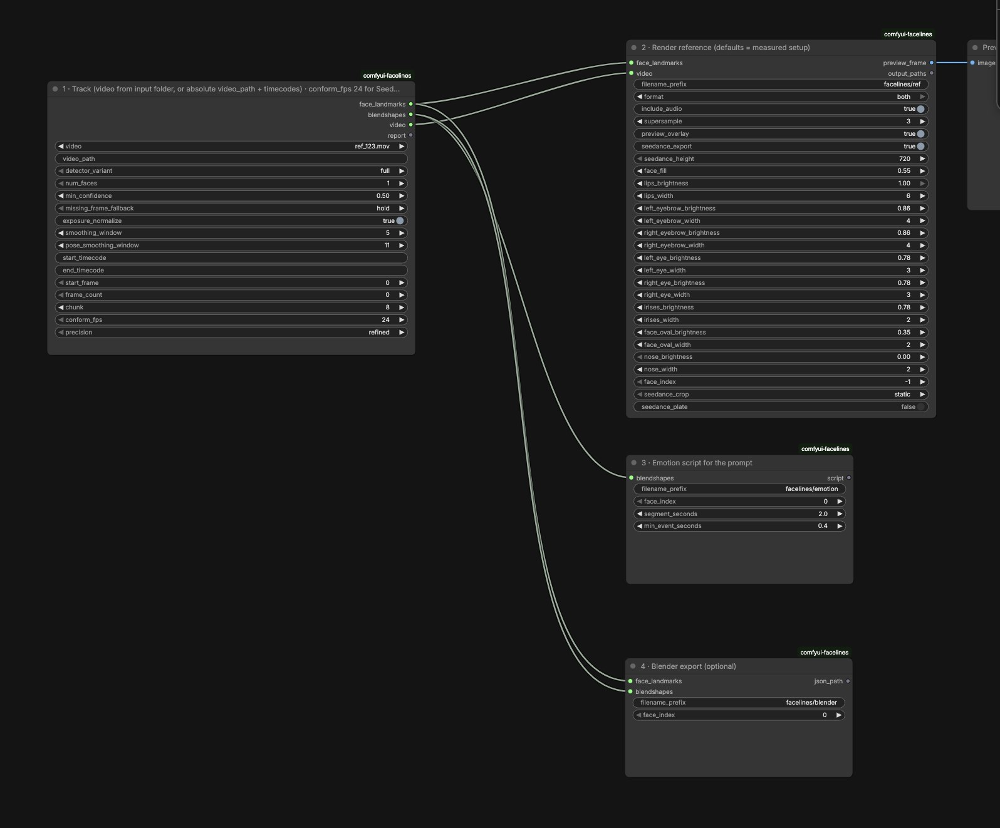

<div class="hero" markdown="1">

# Julian Brednich

<p class="tagline">Technical Artist with a focus on Houdini, Python, pipeline tools and 3D-to-AI workflows. Recent Audiovisual Media graduate (HdM Stuttgart), currently Technical Director at No Notes Studio.</p>

<div class="links">
  <a class="btn primary" href="https://vimeo.com/1133149897?fl=pl&fe=sh" target="_blank" rel="noopener">Watch Reel</a>
  <a class="btn" href="mailto:julian.brednich@gmail.com">Email</a>
  <a class="btn" href="https://www.linkedin.com/in/julian-brednich-32aaa8298" target="_blank" rel="noopener">LinkedIn</a>
</div>

</div>

<section id="reel" markdown="1">

<p class="eyebrow">Showreel</p>

## VFX Reel

<a class="media video" href="https://vimeo.com/1133149897?fl=pl&fe=sh" target="_blank" rel="noopener">
  
  <span class="play" aria-hidden="true"></span>
  <span class="label">Watch on Vimeo</span>
</a>

</section>

<section id="lighting-tool" markdown="1">

<p class="eyebrow">Bachelor Thesis · Houdini</p>

## Procedural Lighting Tool

<ul class="tags">
  <li>Houdini</li><li>Python</li><li>VEX</li><li>COPs</li><li>LiDAR</li><li>HDRI</li>
</ul>

A procedural tool developed in Houdini using Python and VEX that automatically generates area lights from LiDAR scans and HDRI data.
The tool analyzes LiDAR-based geometry, extracts local orientation, computes light dimensions, bakes texture projections, and constructs production-ready lights with correct transforms.

<a class="media video" href="https://vimeo.com/1144911549?share=copy&fl=sv&fe=ci" target="_blank" rel="noopener">
  
  <span class="play" aria-hidden="true"></span>
  <span class="label">Demo video</span>
</a>

### How it works

1. Projects the HDRI onto the LiDAR geometry
2. Finds light sources based on an artist-defined luminance threshold
3. Deletes all geometry that is not part of the detected light sources
4. Creates grid geometries representing area lights
5. Extracts a 3×3 transform matrix, converts it into Euler rotations, and computes the light dimensions from the bounding boxes
6. Automatically renders emission maps using COPs based on the projected texture
7. Creates light nodes with the correct transform, size, and baked textures

<details markdown="1">
<summary>Show example code snippet (not full code)</summary>

```python
# Get the matrix from the point attribute
pt = xform_geo.iterPoints()[0]
matrix_vals = pt.attribValue("transform")  # 9 floats
matrix3 = hou.Matrix3(matrix_vals)
R = matrix_vals
R00, R01, R02 = R[0], R[1], R[2]
R10, R11, R12 = R[3], R[4], R[5]
R20, R21, R22 = R[6], R[7], R[8]
if abs(R20) != 1:
    pitch = -math.asin(R20)
    cos_pitch = math.cos(pitch)
    roll = math.atan2(R21 / cos_pitch, R22 / cos_pitch)
    yaw = math.atan2(R10 / cos_pitch, R00 / cos_pitch)
else:
    yaw = 0
    if R20 == -1:
        pitch = math.pi / 2
        roll = yaw + math.atan2(R01, R02)
    else:
        pitch = -math.pi / 2
        roll = -yaw + math.atan2(-R01, -R02)
euler_deg = [math.degrees(a) for a in (roll, pitch, yaw)]

# Get bounding box and center
bbox = grid_geo.boundingBox()
center = bbox.center()
size_x = bbox.sizevec()[0]
size_y = bbox.sizevec()[1]

# Get all point positions
points = grid_geo.points()
p0 = points[0].position()
p1 = points[1].position()
p2 = points[2].position()
p3 = points[3].position()
x_vec = p1 - p0
y_vec = p2 - p0
size_x = x_vec.length()
size_y = y_vec.length()

# Render textures
rot_x = euler_deg[0]
if abs(rot_x) > 90:
    flip.bypass(False)
toCopsNode.cook(force=True)
cop_node.cook(force=True)
rop.parm("copoutput").set(texture_path)
rop.render()
flip.bypass(True)
if iteration == 0:
    env_texture_path = f"{version_path}/Environment.exr"
    rop_env.parm("copoutput").set(env_texture_path)
    rop_env.render()

# Create the area light
light = hou.node("/obj").createNode("custom_light", light_name)
light.parm("light_type").set(2)
light.parmTuple("position_vector").set(center)
light.parm("distance_mult").set(1)
light.parmTuple("rotate").set(euler_deg)
light.parm("area_sizex").set(size_x)
light.parm("area_sizey").set(size_y)
light.parm("light_intensity").set(1.0)
light.parm("light_enable").set(True)

# Set textures
light.parm("light_texture").set(texture_path)
...
```

</details>

</section>

<section id="face-capture" markdown="1">

<p class="eyebrow">No Notes Studio · Reference workflow for AI video</p>

## Single-Camera Facial Capture → 3D Reference → AI Video

<ul class="tags">
  <li>ComfyUI</li><li>MediaPipe</li><li>Python</li><li>Blender</li><li>MetaHuman</li><li>ARKit</li><li>Seedance</li>
</ul>

A facial motion capture workflow that only needs a single camera. It was developed at No Notes Studio as a reference workflow to give AI video generation precise control over performance and timing: an actor's face is tracked from a normal video, transferred to a MetaHuman head in Blender, and the resulting 3D render is used as a reference for Seedance to generate the final shot.

<div class="compare">
  <figure class="media">
    <video src="assets/video/sc86_3d_reference.mp4" poster="assets/img/sc86_3d_reference.jpg" autoplay muted loop playsinline></video>
    <figcaption>3D reference – MetaHuman head in Blender, driven by the captured performance</figcaption>
  </figure>
  <figure class="media">
    <video src="assets/video/sc86_ai_result.mp4" poster="assets/img/sc86_ai_result.jpg" autoplay muted loop playsinline></video>
    <figcaption>Final result – AI video generated with Seedance using the 3D render as reference</figcaption>
  </figure>
</div>

### How it works

1. **Tracking in ComfyUI** – a custom node pack (`comfyui-facelines`) tracks the actor's face with MediaPipe: 3D face landmarks, ARKit-style blendshapes and head pose, with smoothing, exposure normalization and frame conforming to 24 fps for Seedance.
2. **Reference plates and emotion script** – the same graph renders face-line reference frames for Seedance and writes a time-coded emotion script that feeds into the prompt.
3. **JSON export** – landmarks and blendshapes are exported as a JSON file.
4. **Blender import** – a Python script I wrote reads the JSON and keys the ARKit shape keys and head transforms on a MetaHuman head in Blender.
5. **3D render as reference** – the animated head is rendered in the blocked-out set and handed to Seedance as a video reference.
6. **AI generation** – Seedance generates the final shot, following the performance, framing and timing of the 3D reference.

<figure class="media">
  
  <figcaption>The ComfyUI graph: track, render reference, emotion script and Blender export</figcaption>
</figure>

<details markdown="1">
<summary>Show example code snippet (Blender import, not full code)</summary>

```python
import bpy
import json
import mathutils

# The imported MetaHuman head consists of several meshes (head, teeth, eyes),
# each with its own shape-key block. Every blendshape from the JSON is applied
# to every object that has a shape key with that exact name.
TARGET_OBJECT_NAMES = ["head_lod0_ORIGINAL", "teeth_ORIGINAL",
                       "eyeLeft_ORIGINAL", "eyeRight_ORIGINAL"]
SCALE = 0.01              # raw data is in cm -> metres
MOTION_SCALE = 0.3        # dampen head motion to 30 %
REFERENCE_FRAME_INDEX = 0 # frame that counts as "no movement"

with open(JSON_PATH, "r") as f:
    data = json.load(f)

names       = data["blendshape_names"]
blendshapes = data["blendshapes"]
matrices    = data["head_transform_4x4"]

# collect shape-key blocks of all target meshes
target_key_blocks = {}
for obj_name in TARGET_OBJECT_NAMES:
    obj = bpy.data.objects.get(obj_name)
    if obj and obj.type == 'MESH' and obj.data.shape_keys:
        target_key_blocks[obj_name] = obj.data.shape_keys.key_blocks

# bind the head group to an empty via Child-Of, so the recorded transform
# is added as a delta instead of replacing the group's position
con = root_group.constraints.new(type='CHILD_OF')
con.target = head_empty
con.inverse_matrix = mathutils.Matrix.Identity(4)

# all frames are computed relative to the reference frame, otherwise the
# head "teleports" to where the camera stood during the recording
reference_matrix_inv = mathutils.Matrix(matrices[REFERENCE_FRAME_INDEX]).inverted()

for i in range(data["frame_count"]):
    frame = START_FRAME + i
    scene.frame_set(frame)

    # key ARKit shape keys on every matching object
    for name, value in zip(names, blendshapes[i]):
        if name == "_neutral":
            continue
        for key_blocks in target_key_blocks.values():
            kb = key_blocks.get(name)
            if kb is not None:
                kb.value = value
                kb.keyframe_insert(data_path="value", frame=frame)

    # head transform: delta to reference, axis correction (Y-up -> Z-up)
    delta_mat = reference_matrix_inv @ mathutils.Matrix(matrices[i])
    corrected = mathutils.Matrix.Rotation(-1.5708, 4, 'X') @ delta_mat

    loc = corrected.to_translation() * SCALE * MOTION_SCALE
    # rotation can't simply be scaled -> slerp between identity and full rotation
    rot = mathutils.Quaternion((1.0, 0.0, 0.0, 0.0)).slerp(corrected.to_quaternion(), MOTION_SCALE)

    head_empty.location = loc
    head_empty.rotation_mode = 'QUATERNION'
    head_empty.rotation_quaternion = rot
    head_empty.keyframe_insert(data_path="location", frame=frame)
    head_empty.keyframe_insert(data_path="rotation_quaternion", frame=frame)
...
```

</details>

</section>

<section id="script-sorter" markdown="1">

<p class="eyebrow">Tool · Nuke</p>

## Nuke Script Sorter

<ul class="tags">
  <li>Nuke</li><li>Python</li><li>OOP</li><li>Recursion</li>
</ul>

A tool that automatically cleans up and organizes Nuke node graphs. It straightens the primary B-pipe, restructures all A-pipes into clean rectangular layouts, and inserts dot nodes where necessary to keep connections clear and readable.
Special care is taken to correctly handle secondary B-pipes, so that existing branching logic and node relationships are preserved.

The result is a significantly more readable node graph. It works best when used regularly during comping to keep the graph clean from the start. Internally, the script uses object orientation and a binary search tree to represent the node graph and iterates over the selected nodes using recursion.

<figure class="media">
  
</figure>

<details markdown="1">
<summary>Show example code snippet (not full code)</summary>

```python
import nuke
import sys

SELECTED_NODES = ()

class ScriptTermination(Exception):
    pass

class BSTNode:
    def __init__(self, node=None, root=None, is_b=False):
        self.val = node
        self.root = root
        self.is_b = is_b
        if not self.is_b:
            self.root = self.val
        self.a = self.get_a()
        self.b = self.get_b()
        # only sort selected node
        for node in SELECTED_NODES:
            if self.val == node:
                self.sort()

    def get_b(self):
        if not self.is_selected(self.val):
            return None
        input_b = self.val.input(0)
        if self.val.Class() == "ScanlineRender" or self.val.Class() == "ApplyMaterial":
            input_b = self.val.input(1)
        if self.b_is_on_the_side(input_b):
            return None
        # create child b
        if input_b:
            return BSTNode(input_b, self.root, True)
        else:
            return None

    def get_a(self):
        if not self.is_selected(self.val):
            return None
        if self.val.Class() == "ScanlineRender" or self.val.Class() == "ApplyMaterial":
            b_index = 1
        else:
            b_index = 0
        input_nodes = []
        # Iterate over all possible inputs
        for i in range(self.val.inputs()):
            input_node = self.val.input(i)
            if i is b_index:
                if not self.b_is_on_the_side(input_node):
                    input_node = None
            input_nodes.append(input_node)
        input_a = input_nodes
        if input_a:
            for i in range(len(input_a)):
                node = input_a[i]
            a_BTS_nodes = []
            for a_child in input_a:
                nextInputNode = BSTNode(a_child, self.root)
                a_BTS_nodes.append(nextInputNode)
            return a_BTS_nodes
        return None
...
```

</details>

</section>

<section id="contact" markdown="1">

<p class="eyebrow">Get in touch</p>

## Contact

<ul class="contact-list">
  <li><strong>Email</strong> <a href="mailto:julian.brednich@gmail.com">julian.brednich@gmail.com</a></li>
  <li><strong>LinkedIn</strong> <a href="https://www.linkedin.com/in/julian-brednich-32aaa8298" target="_blank" rel="noopener">linkedin.com/in/julian-brednich</a></li>
  <li><strong>Reel</strong> <a href="https://vimeo.com/1133149897?fl=pl&fe=sh" target="_blank" rel="noopener">vimeo.com/1133149897</a></li>
</ul>

</section>
